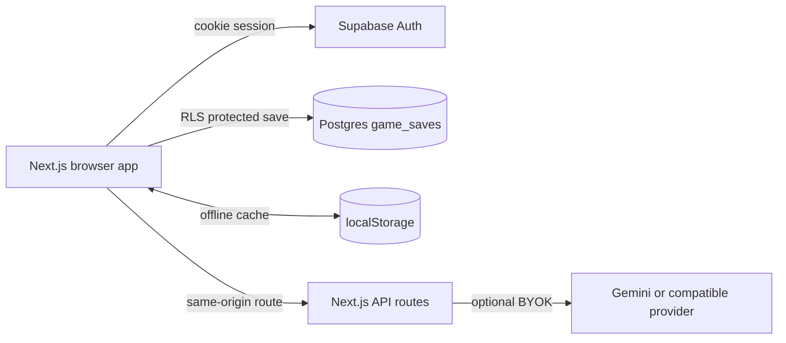

# ShiftQuest

[](https://github.com/efeyazgi/ShiftQuest/actions/workflows/ci.yml)
[](https://nextjs.org/)
[](https://supabase.com/)
[](LICENSE)

ShiftQuest, kimya mühendisliği öğrencileri ve kariyerinin başındaki mühendisler için hazırlanmış oyunlaştırılmış bir profesyonel İngilizce eğitim uygulamasıdır. Kullanıcılar kısa iş yeri senaryolarında iletişim pratiği yapar, dinleme alıştırmaları çözer, kelime kasası oluşturur ve gelişimini kariyer haritasında takip eder.

Uygulama bir Next.js App Router projesidir. Hesaplar ve kullanıcıya ait oyun kayıtları Supabase Auth + Postgres üzerinde tutulur; arayüz Vercel’e dağıtılacak şekilde tasarlanmıştır. Harici AI isteğe bağlıdır ve sağlayıcı anahtarları yalnız kullanıcının tarayıcısında kalır.

## Öne çıkan özellikler

- B1 ve B2 seviyelerine uyarlanan 12 görevlik kariyer haritası
- Diyalog seçimi, cümle kurma, dinleme, eşleştirme, ton kontrolü ve roleplay adımları
- XP, coin, başarımlar, seri takibi ve bölge kilitleri
- Leitner kutuları ve ustalık puanlarıyla Word Vault tekrar sistemi
- Amerikan ve Britanya İngilizcesi ses tercihleri
- Google Gemini ve OpenAI uyumlu görev motoru/TTS desteği
- Harici AI çalışmadığında deterministik görev fallback’i
- E-posta/şifre hesabı, e-posta doğrulama ve şifre sıfırlama
- Supabase RLS ile kullanıcıya özel bulut kaydı
- Çevrimdışı localStorage önbelleği ve yeniden bağlanınca senkronizasyon
- İlk girişte eski yerel ilerlemeyi hesaba aktarma ve çakışma seçim ekranı
- JSON dışa/içe aktarım, azaltılmış hareket ve yüksek kontrast seçenekleri

## Mimari



Oyun durumu mevcut Zustand modelini koruyan tek bir sürümlü JSONB belge olarak saklanır. `game_saves.user_id`, `auth.users.id` alanına bağlıdır. SELECT, INSERT, UPDATE ve DELETE politikalarının tamamı `(select auth.uid()) = user_id` sahiplik kontrolünü kullanır.

API anahtarları `shiftquest-runtime-providers-v1` adlı ayrı tarayıcı kaydındadır. Oyun store’una, Supabase’e veya JSON yedeğine eklenmez ve kullanıcı çıkış yaptığında temizlenir.

## Teknoloji yığını

- Next.js 15, React 19 ve TypeScript
- Tailwind CSS ve Framer Motion
- Zustand
- Supabase Auth, Postgres ve Row Level Security
- Zod
- Recharts
- Vercel

## Yerel kurulum

Gereksinimler:

- Node.js 20 veya üzeri
- npm
- Bir Supabase projesi

```bash
git clone https://github.com/efeyazgi/ShiftQuest.git
cd ShiftQuest
npm install
copy .env.example .env.local
```

`.env.local` içindeki zorunlu alanlar:

```dotenv
NEXT_PUBLIC_SUPABASE_URL=https://YOUR_PROJECT.supabase.co
NEXT_PUBLIC_SUPABASE_PUBLISHABLE_KEY=sb_publishable_...
```

`service_role` veya `sb_secret_...` anahtarını hiçbir zaman `NEXT_PUBLIC_` değişkenine koymayın.

Migration’ı uygulayın:

```bash
npx supabase login
npx supabase link --project-ref YOUR_PROJECT_REF
npx supabase db push
```

Supabase Dashboard → Authentication → URL Configuration bölümünde:

- Site URL: production Vercel adresi
- Redirect URL: `http://localhost:3000/**`
- Redirect URL: `https://YOUR_VERCEL_DOMAIN/**`

Ardından uygulamayı başlatın:

```bash
npm run dev
```

Uygulama [http://localhost:3000](http://localhost:3000) adresinde açılır.

## Auth ve bulut kayıt davranışı

1. Kullanıcı e-posta ve en az 8 karakterlik şifreyle kayıt olur.
2. Supabase doğrulama e-postası `/auth/callback` rotasına döner.
3. Eski bir `shiftquest-game-v1` kaydı varsa yeni hesaba aktarılır.
4. Hem cihazda hem bulutta farklı kayıt varsa kullanıcı hangi kaydın korunacağını seçer.
5. Değişiklikler 900 ms beklemeli olarak buluta yazılır.
6. Ağ kesilirse Zustand persist yerel çalışmayı sürdürür; bağlantı dönünce revision kontrollü senkronizasyon yapılır.

Bulut kayıt şeması [migration dosyasında](supabase/migrations/20260715203142_shiftquest_cloud_saves.sql) bulunur.

## İsteğe bağlı AI ve ses

ShiftQuest dış servis olmadan oynanabilir. Ayarlar → Provider Studio üzerinden kullanıcı kendi sağlayıcısını seçebilir:

- Google Gemini görev motoru
- Google Gemini neural TTS
- OpenAI uyumlu metin veya konuşma uç noktaları
- Tarayıcı SpeechSynthesis fallback’i

Gemini anahtarı [Google AI Studio](https://aistudio.google.com/apikey) üzerinden oluşturulur. Anahtar yalnız sağlayıcı isteği sırasında aynı-origin Next.js API rotasına gönderilir; sunucuda kalıcı olarak saklanmaz.

## Vercel dağıtımı

1. GitHub deposunu Vercel’e import edin.
2. Framework preset olarak Next.js seçili kalabilir.
3. `NEXT_PUBLIC_SUPABASE_URL` ve `NEXT_PUBLIC_SUPABASE_PUBLISHABLE_KEY` değişkenlerini Production, Preview ve Development ortamlarına ekleyin.
4. Deploy sonrasında Vercel adresini Supabase Auth Site URL ve Redirect URL listesine ekleyin.

Sunucuya ait ortak AI anahtarı varsayılan olarak kullanılmaz. Bu tercih ücretsiz kotanın kötüye kullanımını önler.

## Komutlar

| Komut | Açıklama |
| --- | --- |
| `npm run dev` | Yerel geliştirme sunucusu |
| `npm run typecheck` | TypeScript tip kontrolü |
| `npm run lint` | ESLint kontrolü |
| `npm run build` | Production build |
| `npm start` | Production sunucusu |

GitHub Actions her push ve pull request’te `npm ci`, typecheck, lint ve build çalıştırır.

## Proje yapısı

```text
app/                  Next.js sayfaları, auth callback ve API route'ları
components/           UI, layout, tutorial, senaryo ve ayar bileşenleri
data/                 Senaryolar, kelime bankası ve kariyer kataloğu
features/game/        Zustand oyun store'u
features/providers/   Tarayıcıya özel sağlayıcı ayarları
features/sync/        Supabase bulut kayıt koordinasyonu
lib/providers/        LLM/TTS sağlayıcı adaptörleri
lib/supabase/         Browser/server istemcileri ve session middleware
supabase/migrations/  Sürüm kontrollü Postgres şeması ve RLS
```

## Güvenlik ve gizlilik

- Public istemcide yalnız Supabase publishable key bulunur.
- Secret/service-role anahtarı uygulama kodunda kullanılmaz.
- `public.game_saves` üzerinde RLS zorunludur ve anonim role tablo izni verilmez.
- Provider URL’leri HTTPS ve izinli origin kontrollerinden geçer.
- Runtime provider sırları hata yanıtlarına veya loglara yazılmaz.
- Harici AI devre dışı kaldığında uygulama kilitlenmez.

Açık bildirim için [SECURITY.md](SECURITY.md), veri işleme özeti için [PRIVACY.md](PRIVACY.md) dosyasına bakın.

## Katkı

Hata raporları ve geliştirme önerileri memnuniyetle karşılanır. Başlamadan önce [CONTRIBUTING.md](CONTRIBUTING.md) ve [CODE_OF_CONDUCT.md](CODE_OF_CONDUCT.md) dosyalarını okuyun.

## Lisans

Bu proje [MIT Lisansı](LICENSE) ile yayımlanır. Eğitim içeriğini veya uygulamayı gerçek tesis operasyonu ve güvenlik talimatı yerine kullanmayın.
